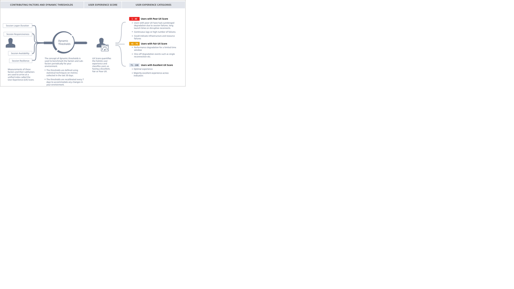

# Demo Guide – Citrix Performance Analytics

**Author:** Russell Peters

**Date:** 24/07/20

## Overview

Secure Workspace & Improve user experience, machine learning will pull data from CVAD, CEM, Content & Collaboration & Networking & Access Control
Providing a user centric experience score

  >Note : This is a Citrix Cloud service, but can monitor an on prem Citrix Environment

Test1:

Test2:

  

Test3:

Test4:
  